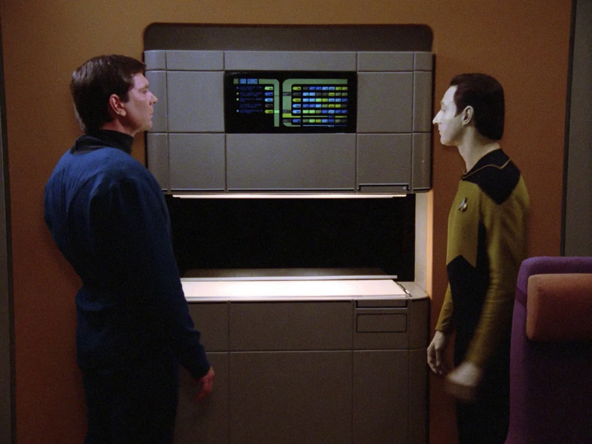

# replicator

Turn one image into many.

## about

This is a project created during 20% time meant to allow me to learn and gain more experience in the various technologies related to my professional work. Some of it is new to me, some of it will be new to the tech stack.

## tech

* nextjs
* ruby on rails
* go
* kubernetes
* tuber
* kafka

The goal of the project will be to have a front end that allows users to specify one or more images to have multiple renditions created of the base image. The renditions created will/can include things like web optimized, different sizes, etc. The settings for what is created will be configurable from the web UI and/or specified in a JSON config file.

## credits

<a target="_blank" href="https://icons8.com/icon/zELcH06HQNGP/photo-gallery">Photo Gallery</a> icon by <a target="_blank" href="https://icons8.com">Icons8</a>
